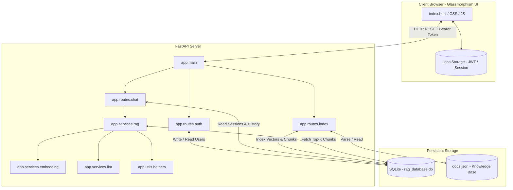

# Production-Grade GenAI Chat Assistant with RAG

This repository contains a production-ready, security-audited **Retrieval-Augmented Generation (RAG) Chat Assistant** built using **FastAPI** on the backend, a custom **SQLite-backed vector similarity store**, and a responsive **glassmorphic HTML/CSS/JS frontend**.

Developed as a standalone submission, it demonstrates real semantic search capability using vector embeddings, cosine similarity rankings, strict response grounding thresholds, JWT user authentication, and persistent chat sessions.

---

## 🏗️ System Architecture

The following diagram illustrates the structural layout of the backend services, vector database, and the frontend interactive dashboard:



---

## ⚡ RAG Workflow Breakdown

### 1. Document Indexing Flow (Offline / Admin Startup)
1. **Load**: The server reads the structured `docs.json` knowledge base containing company policies.
2. **Chunk**: Documents exceeding length limitations are divided into overlapping chunks (~120-150 words, with a 25-word sliding window overlap) using a deterministic token-approximating chunker. This retains boundary context.
3. **Embed**: Chunks are processed via the active embedding provider (Gemini `text-embedding-004` or OpenAI `text-embedding-3-small`). If running offline, a deterministic hash-based vectorizer acts as a local fallback.
4. **Store**: Vector coordinates are serialized as JSON arrays and saved to the SQLite `document_chunks` table, alongside parent metadata (title, token count, text content).

### 2. Retrieval and Querying Flow (User Request)
1. **Authorize**: Requests to `/api/chat` verify the client's JWT token.
2. **Retrieve History**: The backend retrieves the last 5 conversation pairs (10 messages total) for the active `sessionId` from SQLite.
3. **Embed Query**: The user's query is converted to a vector representation.
4. **Calculate Similarity**: The backend calculates the **Cosine Similarity** between the query vector $Q$ and all stored chunk vectors $C$ inside the database:
   $$\text{Cosine Similarity}(Q, C) = \frac{Q \cdot C}{\|Q\| \|C\|}$$
5. **Threshold Filter**: Chunks scoring below the `SIMILARITY_THRESHOLD` (default `0.70`) are dropped.
6. **Grounding Evaluation**:
   - **If no chunks pass threshold**: The LLM is bypassed, and a safe grounded response is immediately returned: *"I could not find enough information in the knowledge base to answer this question."*
   - **If chunks pass**: The Top-3 matching chunks are sorted and formatted into a structured RAG prompt.
7. **LLM Invocation**: The grounded prompt is sent to the LLM (Gemini `gemini-1.5-flash` or OpenAI `gpt-3.5-turbo`) at a low temperature of `0.2` to eliminate hallucinations.
8. **Logging & Return**: Tokens, similarity scores, and sources are updated in the SQLite database and returned to the UI dashboard.

---

## 📂 Project Structure

```
project/ (Workspace Root)
│
├── app/
│   ├── routes/
│   │   ├── auth.py          # /api/auth/register & /api/auth/login JWT endpoints
│   │   ├── chat.py          # /api/chat core endpoint & session logs
│   │   └── index.py         # Administrative endpoints & document cataloging
│   │
│   ├── services/
│   │   ├── embedding.py     # Embedding client (Gemini / OpenAI / Offline Mock)
│   │   ├── llm.py           # LLM caller (Gemini / OpenAI / Offline Mock)
│   │   └── rag.py           # Core RAG coordinator pipeline
│   │
│   ├── models/
│   │   └── schemas.py       # Pydantic schema validation structures
│   │
│   ├── vectorstore/
│   │   └── database.py      # SQLite manager & numpy cosine similarity computations
│   │
│   ├── prompts/
│   │   └── templates.py     # Grounding context instructions
│   │
│   ├── utils/
│   │   └── helpers.py       # Cryptographic PBKDF2 hashing & text chunking
│   │
│   └── main.py              # FastAPI app instance, lifespans, and error interceptors
│
├── frontend/
│   ├── index.html           # Authentication views & glassmorphic workspace layout
│   ├── styles.css           # Modern, responsive stylesheet (dark-violet palette)
│   └── app.js               # Dashboard controller, API fetches, and RAG inspector
│
├── docs.json                # Knowledge base containing 7 detailed portal guidelines
├── requirements.txt         # Pinned python library requirements
├── verify_backend.py        # Independent backend module testing script
├── .env.example             # Configuration instructions
└── README.md                # Submission documentation
```

---

## 🔑 Database Schema Details

The application uses a persistent SQLite database (`rag_database.db`) featuring 5 relational tables:

1. **`users`**: Registers credentials with username unique constraints and PBKDF2 hashed password records.
2. **`documents`**: Tracks active files loaded from `docs.json`.
3. **`document_chunks`**: Stores raw text chunks, mapping IDs, word counts, and JSON-encoded float vectors.
4. **`chat_sessions`**: Connects session IDs to user IDs for multi-user security.
5. **`chat_messages`**: Maintains message history logs, recording role (`user`/`assistant`), token counts, active source IDs, and similarity scores.

---

## 🚀 Setup & Execution Instructions

### Prerequisites
- Python 3.10+ (Tested up to 3.13.13)
- Internet connection (Optional, fallback mock mode available)

### 1. Installation
Clone this repository to your local workspace, open a terminal, and run:
```bash
# Install dependencies (automatically installs pre-compiled wheels for Python 3.13)
pip install -r requirements.txt
```

### 2. Configuration
Copy the `.env.example` template into a active `.env` file:
```bash
copy .env.example .env
```
Open `.env` and configure:
```env
LLM_PROVIDER=gemini # 'gemini' or 'openai' or 'mock'
GEMINI_API_KEY=your_gemini_api_key
JWT_SECRET=use_a_long_random_hash_string_here
```

### 3. Verify Internals
Execute the self-test verification script to confirm database creation, cryptographic hashing, and chunking models compile cleanly:
```bash
python verify_backend.py
```

### 4. Running the Application
Start the FastAPI server using Uvicorn:
```bash
python -m uvicorn app.main:app --reload --host 127.0.0.1 --port 8000
```
Once launched:
- Open your browser and navigate to: **[http://127.0.0.1:8000](http://127.0.0.1:8000)**
- The server will automatically detect that the database is clean, load `docs.json` documents, generate vector embeddings, and initialize the SQLite vector store.

---

## 💎 Bonus Features Implemented

1. **JWT Authentication**: Full signup, login, and secure session management. Password hashing utilizes standard PBKDF2 HMAC SHA-256 with random salt.
2. **Persistent Storage**: SQLite permanently holds documents, user structures, and chat session histories. Users can refresh or close their browser and reload their previous conversation threads.
3. **Multi-Document Retrieval**: Similarity searches are run globally across all chunks in the database, allowing the assistant to gather facts from different source policies to synthesize a unified response.
4. **Interactive RAG Debug Inspector**: The right column of the workspace dashboard lists similarity scores and highlights retrieved text segments in real-time, verifying document indexing and matching transparency.
5. **Auto-Serve Frontend**: The FastAPI app serves the client interface static directory directly, removing any CORS configuration concerns.
